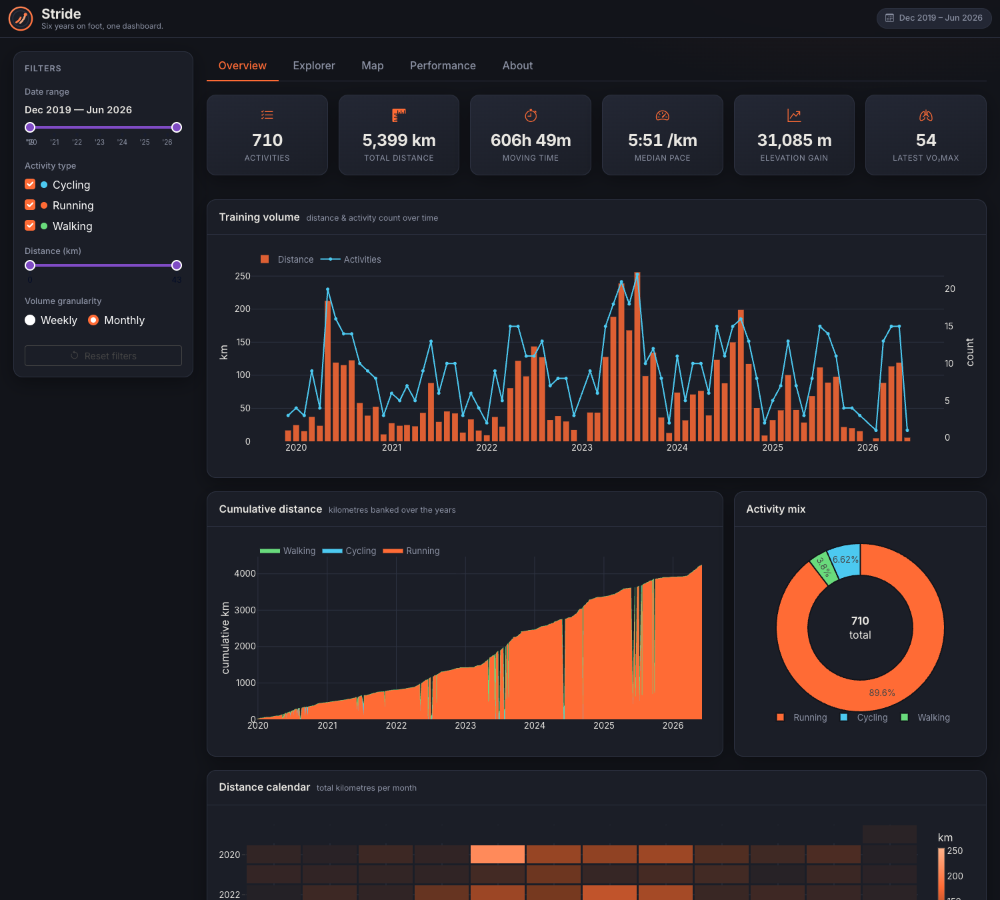
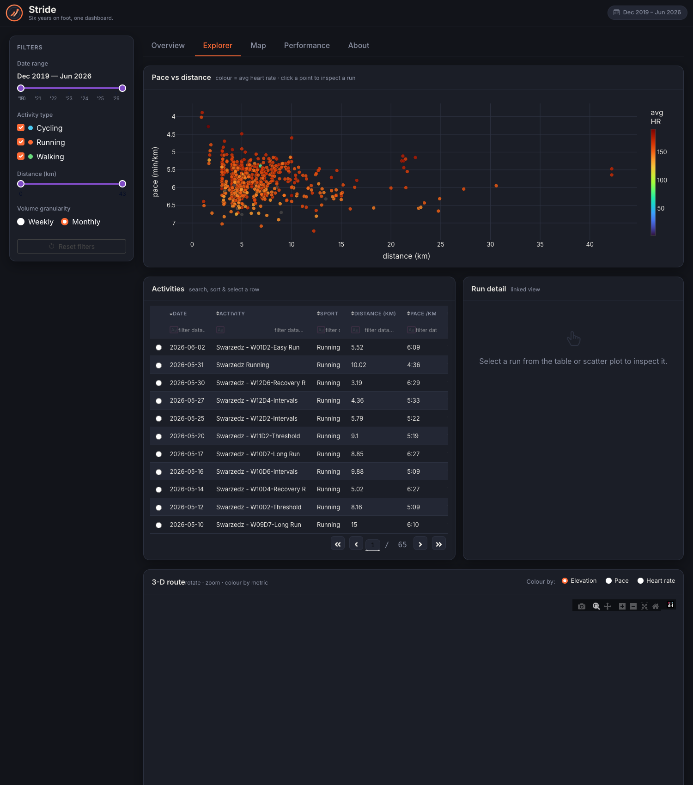
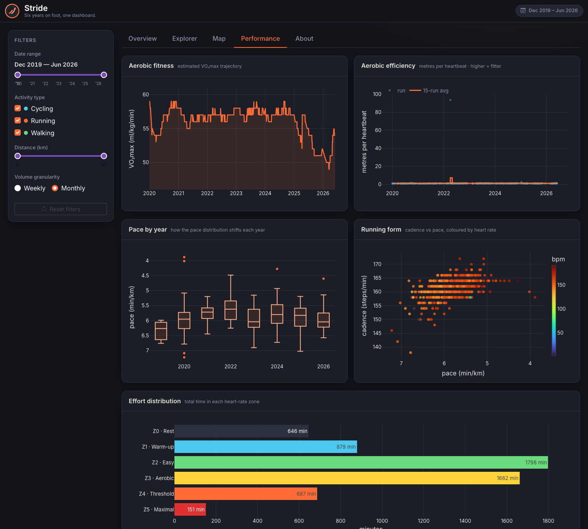
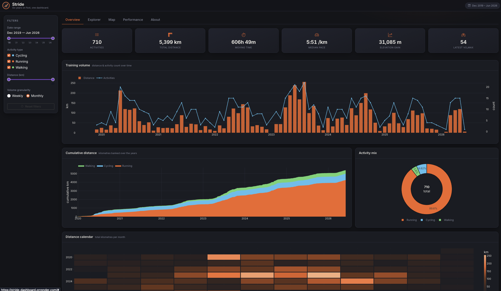
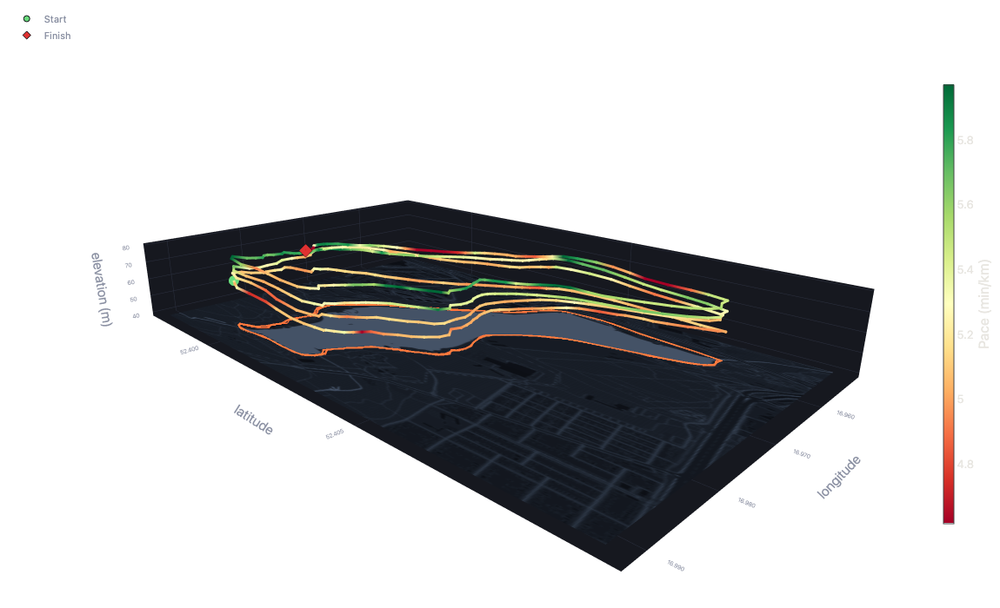
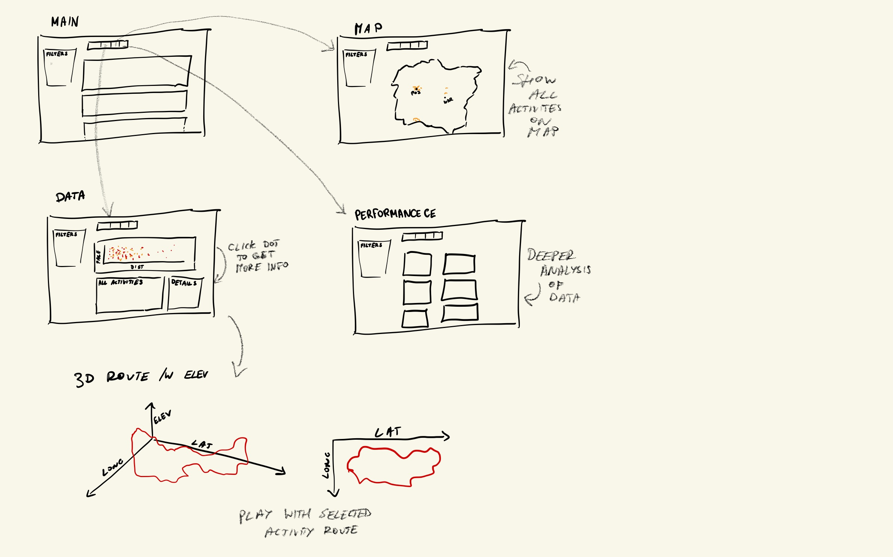

<div align="center">
  
  <h1>Stride · Running Analytics</h1>
</div>

An interactive dashboard that turns a personal **Garmin Connect** data export
into a story about training volume, pace progression, cardiovascular fitness
and running form. Built with **Dash + Plotly**.

> **Live demo:** [https://stride-dashboard.onrender.com/](https://stride-dashboard.onrender.com/)

---

## Screenshots

| Overview | Explorer | Performance |
|---|---|---|
|  |  |  |

**Route coverage** — every recorded GPS track overlaid builds a personal map of
where the training happened (here the Poznań / Swarzędz street network, 641
activities). On the live map this is drawn over a dark Carto basemap; selecting
a run highlights its route.



**3-D route** — selecting a run on the Explorer tab renders a large, rotatable
3-D profile (longitude × latitude × elevation), floating above a real
(pre-fetched, grayscale OpenStreetMap) basemap floor for orientation. The line
colour encodes a metric you choose — elevation, pace or heart rate — so a single
run becomes a rich story.



> Basemaps are fetched **once, offline** by `scripts/fetch_basemaps.py` and
> bundled in `data/processed/basemaps.npz` (711 tiles, ~7 MB) — the live app
> makes zero map-tile network calls.

A pen-and-paper wireframe of the layout was created before implementation:



---

## Why this dashboard

Personal dataset: **711 activities recorded between December 2019 and June
2026** (636 runs, plus rides and walks) exported
from Garmin account.

### Tasks it supports
1. See how weekly / monthly training volume evolves over years.
2. Track pace progression and spot fitness trends.
3. Understand how effort (heart rate) relates to pace.
4. Inspect any single run in detail (splits of effort, location, form).
5. Follow the VO₂max trajectory and running-form metrics.
6. Compare subsets of activities by sport, date range and distance.

---


## Architecture

```
src/garmin_dashboard/
├── app.py            # application factory (create_app)
├── config.py         # paths, constants, env-overridable settings
├── theme.py          # colour palette + shared Plotly template
├── data/
│   ├── loader.py     # cached CSV load + dataset metadata
│   └── transform.py  # pure, tested aggregation/format functions
├── components/       # presentational factories (no callbacks)
│   ├── cards · controls · charts · table · map · detail · navbar
├── layout/           # tab assembly (overview · explorer · physiology · about)
└── callbacks/        # @callback wiring (controls · overview · explorer · physiology)
scripts/prepare_data.py    # ETL: Garmin JSON -> tidy activities CSV
scripts/extract_tracks.py  # ETL: FIT files -> GPS route points (+ HR, pace, elevation)
scripts/fetch_basemaps.py  # ETL: pre-fetch a grayscale OSM basemap per activity
wsgi.py                  # gunicorn entry point
tests/                   # pytest unit tests for the transform layer
```

**Design notes**
- *Separation of concerns:* presentational components are pure factories;
  callbacks are thin and delegate all data work to `data.transform`.
- *Single source of truth for wiring:* widget IDs are module constants imported
  by callbacks, so there are no stray magic strings.
- *Linked-view pattern:* the selected activity lives in a `dcc.Store`, which
  decouples the two selection *sources* (table, scatter) from the three
  *consumers* (scatter highlight, map highlight, detail panel).
- *Twelve-factor friendly:* host/port/debug/data-path read from env vars.

---

## Running locally

```bash
# 1. create an environment
python -m venv .venv && source .venv/bin/activate
pip install -r requirements.txt
pip install -e .                       # makes `garmin_dashboard` importable

# 2. (optional) regenerate the processed data from your own Garmin export
python scripts/prepare_data.py \
    --source /path/to/..._summarizedActivities.json \
    --out data/processed/activities.csv

#    …and the GPS routes for the coverage map (needs the `etl` extra: fitparse)
pip install -e ".[etl]"
python scripts/extract_tracks.py \
    --summary /path/to/..._summarizedActivities.json \
    --zips /path/to/UploadedFiles_0-_Part1.zip /path/to/..._Part2.zip \
    --out data/processed/tracks.csv

#    …and the per-activity OSM basemaps for the 3-D route floor (one-time)
python scripts/fetch_basemaps.py

# 3. run the dev server
python wsgi.py                         # http://127.0.0.1:8050
```

Run the tests with `pytest`.

---

## Deployment

The app exposes a WSGI `server` object, so any Python host works.

- **Render:** push to GitHub → *New → Blueprint* (reads `render.yaml`). Set the
  `DATA_REPO` and `DATA_TOKEN` environment variables (see below) so the build can
  pull the dataset. Done.
- **Docker:** `docker build -t stride . && docker run -p 8050:8050 stride`
  (mount or bake in `data/processed/`).
- **Generic / Railway / Heroku:** the `Procfile` runs `gunicorn wsgi:server`;
  run `python scripts/get_data.py` first to fetch the dataset.

---

## Data & privacy

This is personal GPS / heart-rate data, so the **dataset is never committed to
this public repository**. The processed files
(`activities.csv`, `tracks.csv`, `basemaps.npz`) live in a **separate private
repo** and are pulled into `data/processed/` at deploy time by
[`scripts/get_data.py`](scripts/get_data.py), authenticated with a `DATA_TOKEN`
secret. Locally the files exist but are git-ignored.

- `DATA_REPO` — `owner/name` of the private data repo (e.g. `PTQ-22/stride-data`)
- `DATA_TOKEN` — a GitHub fine-grained PAT with **read** access to that repo

The **raw** Garmin export and the FIT/GPX archives are git-ignored too
(`data/raw/`, `*.zip`) and never leave your machine.

To build your own version: request an export from *Garmin Connect → Account →
Export Your Data*, then run `prepare_data.py`, `extract_tracks.py` and
`fetch_basemaps.py` (see above).

---

## Acknowledgements

AI assistance (Claude) was used for parts of the data analysis and as a
programming aid during development. Some values on the maps (e.g. a few derived
coordinates) are approximate / computed rather than measured.

---

## License

MIT — see [`LICENSE`](LICENSE).
